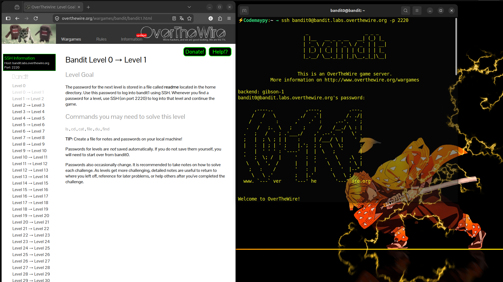
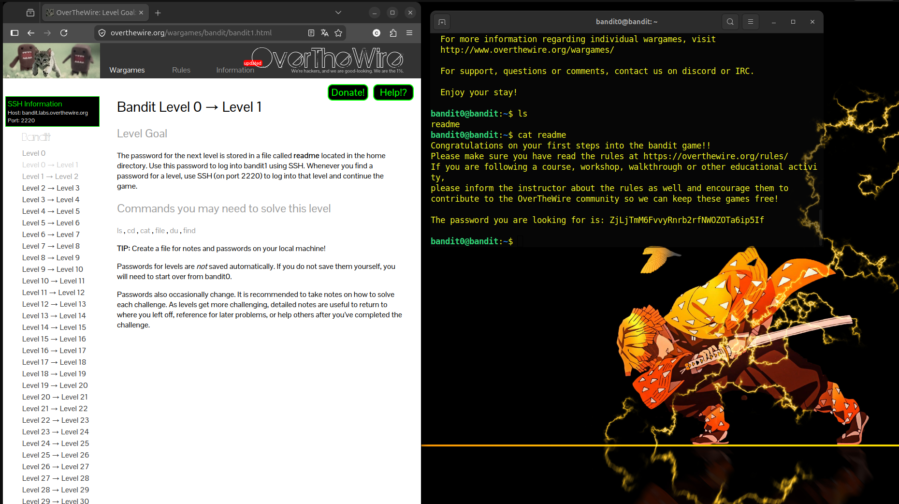
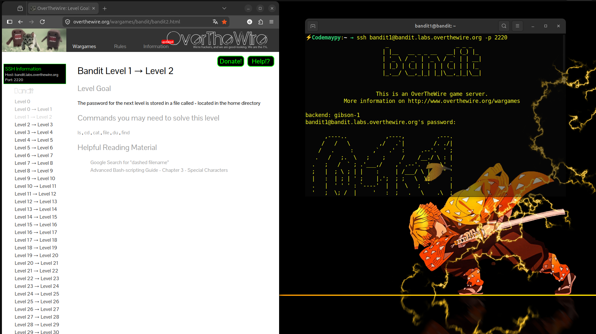
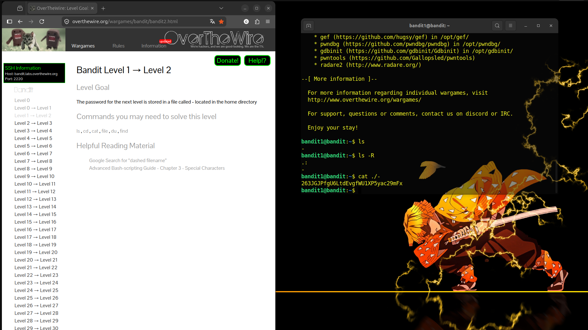

<a name="topo"></a>
# OverTheWire: Bandit Challenge ⚡

    "A jornada de mil comandos começa com um único SSH."

Este repositório é o registro da minha evolução em segurança ofensiva e domínio do terminal Linux, resolvendo os desafios do OverTheWire. Tudo comentado e com explicações, desde os erros até os acertos e conceitos básicos, além de um repósitorio é o meu Relatório do Chuntaro com os resumos e explicações dos conceitos aprendidos.

## Sumário de Explorações
0. [Nível 0](#nível-0)
1. [Nível 1](#nível-1)
2. [Nível 2](#nível-2)

# Nível 0
O objetivo deste nível é fazer login no jogo usando o SSH. O anfitrião ao qual eu preciso me conectar é bandit.labs.overthewire.org, na porta 2220. O nome de usuário é ***bandit0*** e a senha é `bandit0`. 

🔍 **A Primeira Falha (O Aprendizado):**
Inicialmente, tentei o acesso direto:
```Bash
ssh bandit.labs.overthewire.org -p 2220
```
Resultado: `Permission denied.`

**O motivo?** O SSH tentou me autenticar com o usuário local da minha máquina. *No Bandit, precisamos ser específicos.* O servidor só abre as portas para quem se identifica corretamente.

⚡ **Respiração do Trovão, Primeira Forma: O comando certo.**<br>
Ajustei o comando para incluir o usuário `bandit0` e o golpe foi certeiro:
```Bash
# Conectei com o usuário correto 😆
ssh bandit0@bandit.labs.overthewire.org -p 2220

# Explorando o terreno 🧐
ls          # Listei os arquivos e encontrei o readme.
cat readme  # Li o conteúdo: a senha estava lá! 
```
**Password Level 1:** `ZjLjTmM6FvvyRnrb2rfNWOZOTa6ip5If` 


Etapa 1: Login  | Etapa 1: Acesso e exploração |
|:---:|:---:|
|<br><sup>Login via terminal.</sup> |<br><sup>Acesso e verificação de conteúdo</sup> |


#  Chuntaro's Field Notes


### O que é o ssh?<br>
O ssh não é apenas um comando, ele é como um carro blindado que permite o envio de uma mensagem sem ser alterada ou acessada por ninguém.

### Para que serve o SSH
- Acesso Remoto: Você assume o controle de uma máquina a quilômetros de distância como se estivesse nela.
- Criptografia: Tudo o que você digita e o que o servidor responde viaja de forma embaralhada.
- Versatilidade: Além de comandos, ele serve para transferir arquivos (scp) e criar caminhos seguros.

<br>

[↑ Voltar ao topo](#topo)


# Nível 1
O objetivo deste nível é abrir um arquivo chamado `-` localizado no diretório home.

🔍 **A Primeira Falha (O Aprendizado):**
Eu não sabia que o nome do arquivo era  `-`  🤡, então joguei alguns comandos para ver o que tinha na pasta.
```Bash
ls # listar os diretórios
ls -R #lista o diretório + todos os seus subdiretórios de forma recursiva
```
Resultado: `-`

⚡ **Respiração do Trovão, Segunda Forma: O Caminho Explícito!**<br>
Ai eu parei e pensei, ok o nome do arquivo é `-` mas como eu farei para ver ele se o comando `cat` não vai reconhecer o `-` como o nome de um arquivo e sim como um parametro? Ai o google entrou no jogo, e o que precisei fazer foi ser mais explicita para o terminal falando que queria que ele abrise o arquivo com o nome `-`.
```Bash
cat ./- # . significa diretório atual
        # / é o separador das pastas
        # - é o nome do arquivo
```
**Password Level 2:** `263JGJPfgU6LtdEvgfWU1XP5yac29mFx ` 


Etapa 2: Login  | Etapa 2: Exploração |
|:---:|:---:|
| <br><sup>Login via terminal.</sup> | <br><sup>Acesso e verificação de conteúdo</sup> |


#  Chuntaro's Field Notes


 **CHUUU! CHUUU! 🐦⚡**


Excelente técnica! No terminal, nomes de arquivos podem ser traiçoeiros. Sempre que um arquivo tiver um nome que comece com um caractere especial, use ./ na frente para garantir que o comando não se confunda!


## Comandos para treinar:
```Bash
ls # lista
cd # muda o diretório
cat # mostra o conteúdo
file # mostra o tipo de arquivo
du #mostra o tamanho do arquivo
find # procura o arquivo
``` 

[↑ Voltar ao topo](#topo)

# Nível 2
O objetivo deste nível é abrir um arquivo chamado ` --spaces in this filename--` localizado no diretório home.

🔍 A Primeira Falha (O Aprendizado):<br>
Tentei usar o comando `cat` para ver o arquivo, porem como o nome do arquivo possui o caracter `--` o sistema entendeu que eu estava tentando usar algum sinalizador de opção.
```Bash
cat --spaces in this filename--
cat: unrecognized option '--spaces'
Try 'cat --help' for more information.
```

⚡ **Respiração do Trovão: O espaço para a ação.**<br>
Foi ai que puderam  ser usada algumas técnicas para driblar esse nome do arquivo que o sistema reconhece como uma entrada de opção. Nesse caso em específico eu juntei o último exercício e adicionei a tecla `Tab ↹` que completou o nome do arquivo sem eu precisar digitar e correr o risco de errar o nome, mas precisei digitar também o ínicio do nome do arquivo.
```Bash
cat ./--spaces\ in\ this\ filename-- 
MNk8KNH3Usiio41PRUEoDFPqfxLPlSmx
```
Password Level:  `MNk8KNH3Usiio41PRUEoDFPqfxLPlSmx`

Etapa 3: Login  | Etapa 3: Exploração |
|:---:|:---:|
|<br><sup>Login via terminal.</sup> |<br><sup>Acesso e verificação de conteúdo</sup> |

#  Chuntaro's Field Notes

**CHUUU! CHUUU! 🐦⚡**

Muito bem, mas também você pode usar mais formas de "respiração" para enfrentar esse desafio. Como por exemplo: Colocar aspas (duplas ou simples) no nome do arquivo; Usar a barra invertida `\` ou nesse caso o autocompletar com a tecla Tab.
```Bash
# Exemplo 1:
cat "meu arquivo de texto.txt"
# Exemplo 2:
cat 'meu arquivo de texto.txt'
# Exemplo 3:
cat meu\ arquivo\ de\ texto.txt
```

[↑ Voltar ao topo](#topo)

